# ypb 模块依赖关系图

> 生成时间: 2026-07-18T01:03:25.061782+00:00  
> 生成工具: scripts/utils/generate_dep_graph.py (Python AST)  
> 审计批号: 小标-2026-07-18-软件工程 P1-3

## 模块清单（共 50 个）

- `add_std_category.py`
- `add_std_district.py`
- `build_project_links.py`
- `build_unified.py`
- `config.py`
- `crawlers/base.py`
- `crawlers/bigdata.py`
- `crawlers/chennan_kaifaqu.py`
- `crawlers/dongfang.py`
- `crawlers/dushi.py`
- `crawlers/html_common.py`
- `crawlers/jingkai.py`
- `crawlers/jscn.py`
- `crawlers/jszbcg.py`
- `crawlers/jszbcg_parser.py`
- `crawlers/sufu.py`
- `crawlers/sufu_parser.py`
- `crawlers/tyc_crawler.py`
- `crawlers/tyc_login.py`
- `crawlers/yancheng_gov.py`
- `crawlers/ycggzy.py`
- `crawlers/yueda.py`
- `download_jszbcg_pdfs.py`
- `download_site_pages.py`
- `enrich_amendment_opendate.py`
- `enrich_details.py`
- `enrich_jszbcg_ocr.py`
- `enrich_yancheng_gov.py`
- `enrich_yancheng_gov_playwright.py`
- `export_excel.py`
- `extract_sme_target.py`
- `generate_countdown_report.py`
- `generate_countdown_report_pdf.py`
- `generate_intention_report.py`
- `generate_operator_award_report.py`
- `generate_operator_combined_report.py`
- `generate_tender_report.py`
- `pdf_safe_section.py`
- `reenrich.py`
- `report_failed_bids.py`
- `run_collection.py`
- `scripts/utils/backup_all_db.py`
- `scripts/utils/check_complexity.py`
- `scripts/utils/expand_intention.py`
- `scripts/utils/generate_dep_graph.py`
- `scripts/utils/init_failed_records.py`
- `scripts/utils/init_feedback.py`
- `scripts/utils/init_unified_audit.py`
- `scripts/utils/migrate_unified_schema.py`
- `verify_quality.py`

## 依赖图（mermaid）

```mermaid
graph TD
    add_std_category["add_std_category.py"]
    add_std_district["add_std_district.py"]
    build_project_links["build_project_links.py"]
    build_unified["build_unified.py"]
    config["config.py"]
    crawlers_base["crawlers/base.py"]
    crawlers_bigdata["crawlers/bigdata.py"]
    crawlers_chennan_kaifaqu["crawlers/chennan_kaifaqu.py"]
    crawlers_dongfang["crawlers/dongfang.py"]
    crawlers_dushi["crawlers/dushi.py"]
    crawlers_html_common["crawlers/html_common.py"]
    crawlers_jingkai["crawlers/jingkai.py"]
    crawlers_jscn["crawlers/jscn.py"]
    crawlers_jszbcg["crawlers/jszbcg.py"]
    crawlers_jszbcg_parser["crawlers/jszbcg_parser.py"]
    crawlers_sufu["crawlers/sufu.py"]
    crawlers_sufu_parser["crawlers/sufu_parser.py"]
    crawlers_tyc_crawler["crawlers/tyc_crawler.py"]
    crawlers_tyc_login["crawlers/tyc_login.py"]
    crawlers_yancheng_gov["crawlers/yancheng_gov.py"]
    crawlers_ycggzy["crawlers/ycggzy.py"]
    crawlers_yueda["crawlers/yueda.py"]
    download_jszbcg_pdfs["download_jszbcg_pdfs.py"]
    download_site_pages["download_site_pages.py"]
    enrich_amendment_opendate["enrich_amendment_opendate.py"]
    enrich_details["enrich_details.py"]
    enrich_jszbcg_ocr["enrich_jszbcg_ocr.py"]
    enrich_yancheng_gov["enrich_yancheng_gov.py"]
    enrich_yancheng_gov_playwright["enrich_yancheng_gov_playwright.py"]
    export_excel["export_excel.py"]
    extract_sme_target["extract_sme_target.py"]
    generate_countdown_report["generate_countdown_report.py"]
    generate_countdown_report_pdf["generate_countdown_report_pdf.py"]
    generate_intention_report["generate_intention_report.py"]
    generate_operator_award_report["generate_operator_award_report.py"]
    generate_operator_combined_report["generate_operator_combined_report.py"]
    generate_tender_report["generate_tender_report.py"]
    pdf_safe_section["pdf_safe_section.py"]
    reenrich["reenrich.py"]
    report_failed_bids["report_failed_bids.py"]
    run_collection["run_collection.py"]
    scripts_utils_backup_all_db["scripts/utils/backup_all_db.py"]
    scripts_utils_check_complexity["scripts/utils/check_complexity.py"]
    scripts_utils_expand_intention["scripts/utils/expand_intention.py"]
    scripts_utils_generate_dep_graph["scripts/utils/generate_dep_graph.py"]
    scripts_utils_init_failed_records["scripts/utils/init_failed_records.py"]
    scripts_utils_init_feedback["scripts/utils/init_feedback.py"]
    scripts_utils_init_unified_audit["scripts/utils/init_unified_audit.py"]
    scripts_utils_migrate_unified_schema["scripts/utils/migrate_unified_schema.py"]
    verify_quality["verify_quality.py"]
    add_std_category --> config
    build_unified --> build_project_links
    build_unified --> config
    crawlers_bigdata --> enrich_details
    crawlers_chennan_kaifaqu --> enrich_details
    crawlers_dongfang --> enrich_details
    crawlers_dushi --> enrich_details
    crawlers_jingkai --> enrich_details
    crawlers_jscn --> enrich_details
    crawlers_ycggzy --> enrich_details
    crawlers_yueda --> enrich_details
    enrich_jszbcg_ocr --> enrich_details
    enrich_yancheng_gov_playwright --> enrich_details
    generate_countdown_report_pdf --> pdf_safe_section
    generate_intention_report --> pdf_safe_section
    generate_operator_combined_report --> pdf_safe_section
    generate_tender_report --> pdf_safe_section
    reenrich --> enrich_amendment_opendate
    reenrich --> enrich_details
    reenrich --> enrich_jszbcg_ocr
    reenrich --> enrich_yancheng_gov
    run_collection --> config
    verify_quality --> config
```

## 模块依赖统计

| 模块 | 导入数 | 主要依赖 |
|------|--------|----------|
| `enrich_details.py` | 22 | json, logging, re, sqlite3, sys |
| `enrich_jszbcg_ocr.py` | 18 | json, logging, re, sqlite3, tempfile |
| `generate_tender_report.py` | 18 | os, sys, re, sqlite3, logging |
| `generate_intention_report.py` | 17 | os, sys, sqlite3, calendar, logging |
| `crawlers/ycggzy.py` | 16 | json, logging, os, sys, time |
| `generate_countdown_report_pdf.py` | 16 | os, sys, sqlite3, logging, datetime |
| `generate_operator_combined_report.py` | 16 | argparse, os, re, sqlite3, sys |
| `crawlers/jszbcg.py` | 15 | logging, os, sys, time, datetime |
| `generate_operator_award_report.py` | 14 | argparse, os, sys, datetime, collections |
| `run_collection.py` | 14 | argparse, logging, sqlite3, sys, time |
| `crawlers/chennan_kaifaqu.py` | 13 | json, logging, os, re, sys |
| `crawlers/tyc_crawler.py` | 13 | argparse, hashlib, json, logging, os |
| `enrich_yancheng_gov.py` | 13 | asyncio, json, logging, re, sqlite3 |
| `crawlers/bigdata.py` | 12 | json, logging, os, re, sys |
| `crawlers/dongfang.py` | 12 | json, logging, os, re, sys |
| `crawlers/dushi.py` | 12 | json, logging, os, re, sys |
| `crawlers/jingkai.py` | 12 | json, logging, os, re, sys |
| `crawlers/jscn.py` | 12 | json, logging, os, re, sys |
| `crawlers/yueda.py` | 12 | json, logging, os, re, sys |
| `build_unified.py` | 11 | json, logging, sqlite3, sys, pathlib |
| `reenrich.py` | 11 | argparse, logging, sys, pathlib, enrich_details |
| `download_site_pages.py` | 10 | json, logging, re, sqlite3, time |
| `enrich_yancheng_gov_playwright.py` | 10 | logging, re, sqlite3, sys, time |
| `crawlers/base.py` | 9 | hashlib, json, logging, os, re |
| `crawlers/sufu.py` | 9 | json, logging, re, sys, time |
| `crawlers/tyc_login.py` | 9 | json, logging, os, sys, time |
| `crawlers/yancheng_gov.py` | 9 | logging, os, re, sys, time |
| `pdf_safe_section.py` | 9 | typing, logging, platypus, platypus, styles |
| `add_std_category.py` | 8 | sqlite3, pathlib, config, subprocess, sys |
| `export_excel.py` | 8 | logging, sqlite3, pathlib, datetime, pandas |
| `add_std_district.py` | 7 | logging, json, sqlite3, pathlib, subprocess |
| `generate_countdown_report.py` | 7 | sqlite3, datetime, pathlib, typing, openpyxl |
| `crawlers/html_common.py` | 6 | re, pathlib, typing, html2text, requests |
| `download_jszbcg_pdfs.py` | 6 | json, logging, sqlite3, time, pathlib |
| `extract_sme_target.py` | 6 | logging, os, re, sqlite3, sys |
| `scripts/utils/backup_all_db.py` | 6 | argparse, shutil, sys, sqlite3, datetime |
| `scripts/utils/check_complexity.py` | 6 | subprocess, sys, json, datetime, pathlib |
| `build_project_links.py` | 5 | argparse, re, sqlite3, collections, pathlib |
| `enrich_amendment_opendate.py` | 5 | argparse, re, sqlite3, datetime, pathlib |
| `scripts/utils/expand_intention.py` | 5 | argparse, json, re, sqlite3, pathlib |
| `report_failed_bids.py` | 4 | argparse, csv, sqlite3, pathlib |
| `scripts/utils/generate_dep_graph.py` | 4 | ast, sys, pathlib, datetime |
| `scripts/utils/init_failed_records.py` | 4 | sqlite3, sys, datetime, pathlib |
| `scripts/utils/init_unified_audit.py` | 4 | sqlite3, sys, pathlib, datetime |
| `verify_quality.py` | 4 | sqlite3, sys, pathlib, config |
| `crawlers/jszbcg_parser.py` | 3 | json, typing, html_common |
| `scripts/utils/init_feedback.py` | 3 | sqlite3, sys, pathlib |
| `scripts/utils/migrate_unified_schema.py` | 3 | sqlite3, sys, pathlib |
| `crawlers/sufu_parser.py` | 2 | json, typing |
| `config.py` | 0 | - |

## 变更日志

| 日期 | 版本 | 变更 |
|------|------|------|
| 2026-07-18 | v1.0 | 初始版本 |
